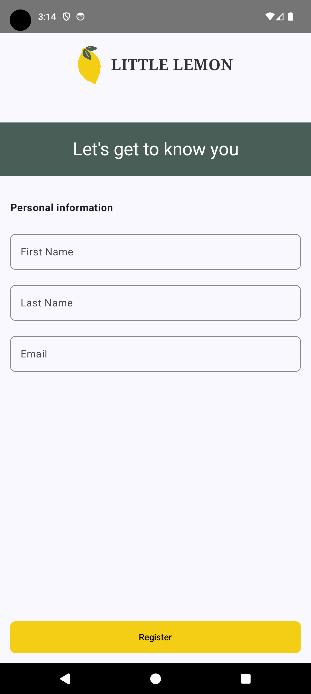
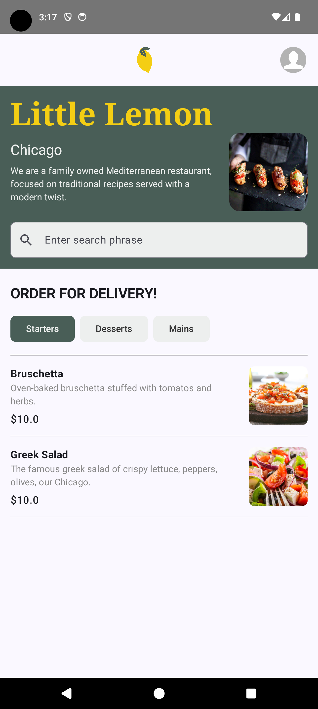
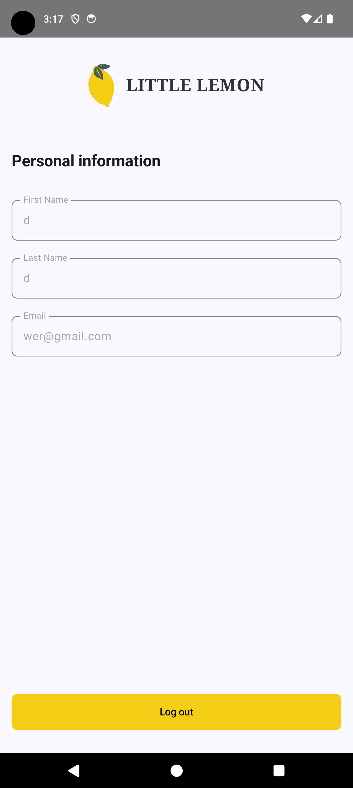

# Little Lemon

This project is the capstone project for the Meta Android Developer Professional Certificate.

## Architecture

The app follows modern Android architecture principles, using the MVVM pattern with a clear separation of concerns.

## Technologies Used

*   **UI:** Jetpack Compose and Material 3 for building the user interface.
*   **Asynchronous Programming:** Kotlin Coroutines and Flow for managing background tasks and data streams.
*   **Dependency Injection:** Koin is used for dependency management.
*   **Networking:** Ktor is used for making network requests to a remote API.
*   **Data Persistence:** Room is used for local data storage.
*   **Image Loading:** Glide is used for loading and displaying images.
*   **Navigation:** Jetpack Navigation for Compose is used to handle navigation within the app.
*   **Testing:** JUnit and MockK are used for unit testing.

## Screenshots

| Onboarding Screen | Home Screen | Profile Screen |
| :---: | :---: | :---: |
|  |  |  |
